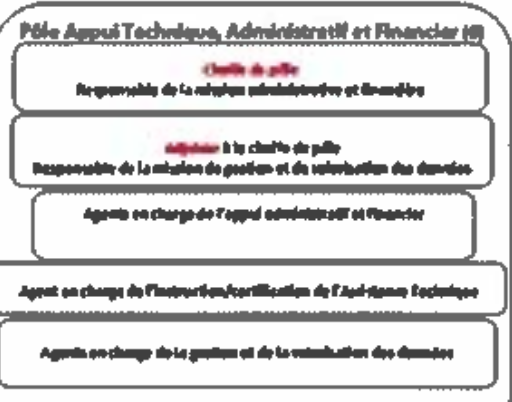

# TL;DR

Version web de l'[organigramme de la CTM](https://guillem.lefait.fr/public-data/mq/ctm/organigramme/index.html) à partir du document [22-PCE-578](https://www.collectivitedemartinique.mq/docs/actes2022/executif/22-PCE-578-organisation-des-services-de-la-CTM.PDF).

# Organigramme CTM

La CTM est issue de la fusion de la région et du département, et donc des personnels associés à chacun d'eux.

Un organigramme a été présenté en séance de l'assemblée de Martinique, on le retrouve dans le document [22-PCE-578](https://www.collectivitedemartinique.mq/docs/actes2022/executif/22-PCE-578-organisation-des-services-de-la-CTM.PDF).

Néanmoins cet organigramme n'est pas présenté sur la [page dédiée du site de la CTM](https://www.collectivitedemartinique.mq/organigramme/) (23 octobre 2022, [archive.org capture](https://web.archive.org/web/20221023132517/https://www.collectivitedemartinique.mq/organigramme/)).

> Pour assurer ce service et sa continuité, un organigramme est en cours élaboration.

Le site de suivi des projets de la mandature actuel indique que le projet a été réalisé (sans réaction lorsque [cela leur a été signalé](https://twitter.com/guillem_lefait/status/1546630050187038724)) :
> Projet 047: Un organigramme fiable et opérationnel sera institué et mis à disposition du public.

Voyons donc si on peut faire un peu mieux.

## Raw data (2022)

Le document pdf [22-PCE-578](https://www.collectivitedemartinique.mq/docs/actes2022/executif/22-PCE-578-organisation-des-services-de-la-CTM.PDF) est compliqué à exploiter :
- format image et non texte
- la présentation graphique est impossible à utiliser dans un format numérique
- mélange de fonctions (associé à une ou plusieurs personnes) et de services (associé à une ou plusieurs personnes)
- pas d'information sur le nombre de personnes associées à chaque service (la CTM compte autour de 4300 agents et contractuels)

Par ailleurs, il contient en page 19, un format différent du reste, plus précis mais malheureusement avec une résolution si faible qu'elle est inutilisable.

## Methodologie

1. OCR
2. Correction manuelle d'une partie des erreurs. Un fichier `organigramme.txt` est produit.
3. Transformation en hierarchie (relation noeud fils/parent) dans un notebook très moche. Un fichier `organigramme.csv` est produit.
4. Présentation avec une [librairie JS](https://github.com/bumbeishvili/org-chart) utilisant d3js `index.html`
